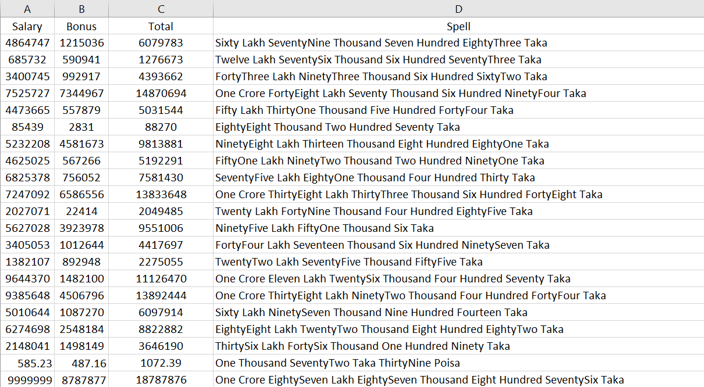
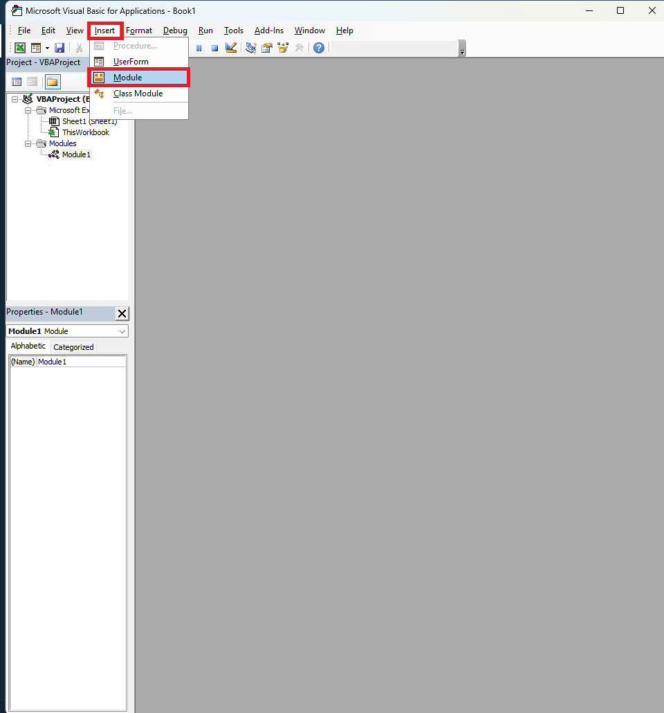
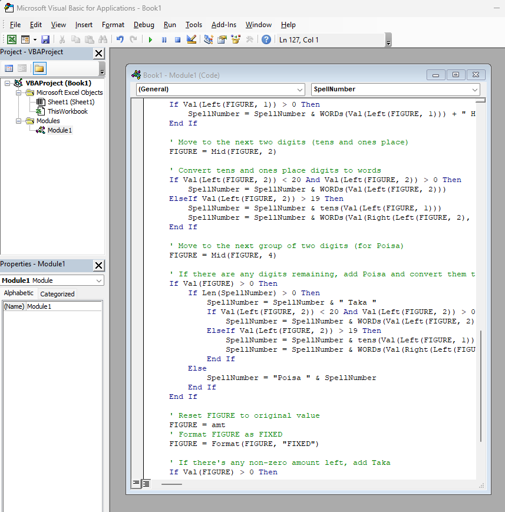
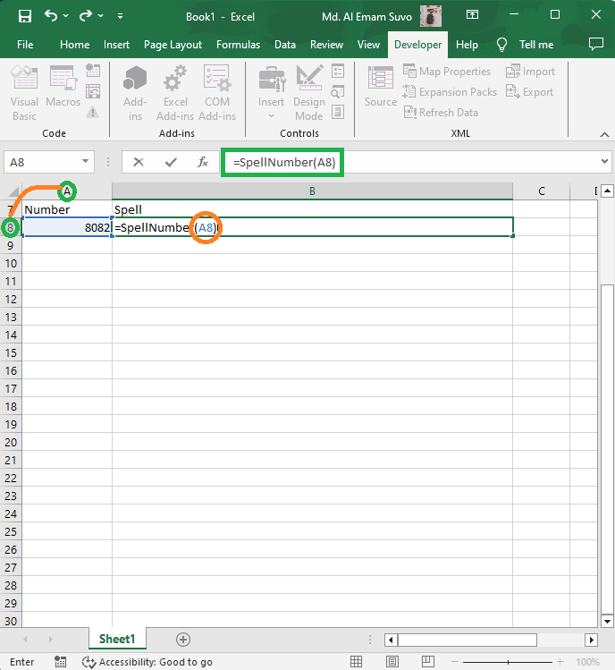
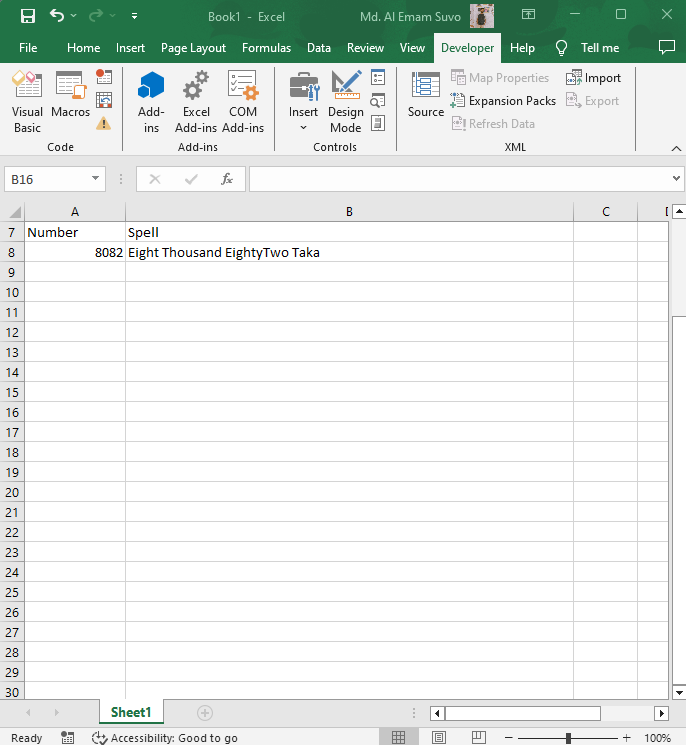

# SpellNumber in Excell

- <h3>Output</h3>

  

## How to do it?

- Open excell and create a new blank workbook.
- Enter [Alt + F11] It will open a Visual Basic Editor. (For more clearance see Figure-1)

  
  
Figure-1

- Copy the code from SpellNumber.txt file and paste it to the editor

  
  
Figure-2

- Enter [Ctrl + s] and save the workbook with .xlsm extension (E.g. SpellNumber.xlsm)
- Now apply the formula [=SpellNumber(cell)] (Replace the cell with actual cell E.g. =SpellNumber(A8))

  
  
Figure-3

- Now you will see the output like Figure-4

  
  
Figure-4

# Limitation
- This formula will not work properly for the number less than 1

👉 If it is helpful give me a star ⭐ Enjoy it. Thank you✨

Made with ❤️ By Al Emam

